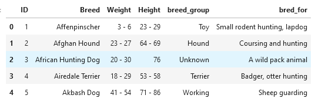
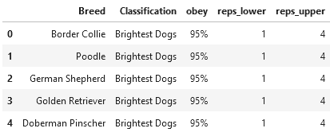
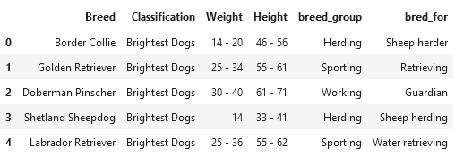

# ETL Project
### Group 1
# Transforming Data to analyse intelligence in dog breeds  

## Background

For this project we'll be Extracting, Transforming and Loading data to a production database so we can analyse properties that correlate with intelligence in various dog breeds.  

In building this database, we'll extract two data sources for analysis and merge them based on their common values in Jupyter notebook. The data will need to be transformed before loading including cleaning, joining, filtering, aggregating, etc. The cleaned data will be loaded into a final production database (relational) where we can view the final tables for analysis.


## Before we begin

1. Created a new repository for this project called ETL_Project.
2. Cloned the new repository to the computer.
3. Inside the local git repository, created a directory for the Resources and
4. Pushed the above changes to GitHub.
5. install psycog2 in terminal/gitbash

### Extract: the original data sources and how the data was formatted
-  Save the dog intelligence csv into the Resources folder.
    * Source: CSV file from https://data.world/len/intelligence-of-dogs/workspace/file?filename=dog_intelligence.csv
-  Save the API key from the dog breed api into an api_keys.py file in the main branch. This will allow access to the API when referenced in Jupyter notebook.
    * Source: API from https://api.thedogapi.com/v1/breeds
- Import python libraries required extracting, transoforming, and loading the data to postgress
```
import pandas as pd
from sqlalchemy import create_engine
import pandas as pd
import numpy as np
import requests
import json
from pprint import pprint

# Import API key
from api_keys import d_key
```
- Create empty lists for the properties to append to.
```
id = []
name = []
weight = []
height = []
bred_for = []
breed_group = []
```
- Request the API using json and pprint the results for analysis.
```
url = r"https://api.thedogapi.com/v1/breeds"
response = requests.get(url).json()

pprint(response[0])
```
```
#output
{'bred_for': 'Small rodent hunting, lapdog',
 'breed_group': 'Toy',
 'height': {'imperial': '9 - 11.5', 'metric': '23 - 29'},
 'id': 1,
 'image': {'height': 1199,
           'id': 'BJa4kxc4X',
           'url': 'https://cdn2.thedogapi.com/images/BJa4kxc4X.jpg',
           'width': 1600},
 'life_span': '10 - 12 years',
 'name': 'Affenpinscher',
 'origin': 'Germany, France',
 'reference_image_id': 'BJa4kxc4X',
 'temperament': 'Stubborn, Curious, Playful, Adventurous, Active, Fun-loving',
 'weight': {'imperial': '6 - 13', 'metric': '3 - 6'}}
```

-  Create a forloop to print the properties in the API that we want for analysis. Append the data into our empty lists.[^1]
[^1]: both the bred_for and breed_group had missing data in the api and thus needed to be updated with the unknown data tag. This is achieved by using an if statement to first test if there is a variable to call, if there is no variable then it will input "Unknown" however, if there is a variable then test for empty string with "if not" statement. If the the variable is empty then this update the string to be "Unknown", but if the there is a string then it will input the strings value.
```
# looping through the API to display specific data 
x=0
while (x) < 4:
    #pprint(response[x])
    print(f"id: {response[x]['id']}")
    print(f"Weight (Kg): {response[x]['weight']['metric']}")
    print(f"Height (cm): {response[x]['height']['metric']}")

    if 'bred_for' in response[x]:
        if not response[x]['bred_for']:
            print("Bred for: Unknown")
        else:
            print(f"Bred for: {response[x]['bred_for']}")
    else:
        print("Bred for: Unknown")

    if 'breed_group' in response[x]:
        if not response[x]['breed_group'] :
            print('Breed Group: Unknown')
        else:
            print(f"Breed Group: {response[x]['breed_group']}")
    else:
        print('Breed Group: Unknown')

    print('....')
    x += 1
```
```
#output
id: 1
Weight (Kg): 3 - 6
Height (cm): 23 - 29
Bred for: Small rodent hunting, lapdog
Breed Group: Toy
....
id: 2
Weight (Kg): 23 - 27
Height (cm): 64 - 69
Bred for: Coursing and hunting
Breed Group: Hound
....
id: 3
Weight (Kg): 20 - 30
Height (cm): 76
Bred for: A wild pack animal
Breed Group: Unknown
....
```

- Create a dictionary for establishing the data frame.
```
dog_data = {
    "ID":id,
    "Breed":name,
    "Weight": weight,
    "Height": height,
    "breed_group": breed_group,
    "bred_for":bred_for,
}
```
- convert dog_data dictionary into a data frame.
```
dog_df = pd.DataFrame(dog_data)

dog_df.head()
```


- Import the CSV and create a new data frame.
```
intelligence = "Resources/intelligence.csv"
intelligence_df = pd.read_csv(intelligence)
intelligence_df.head()
```

### Transform: what data cleaning or transformation was required.

-  Transform the API call into dataframe keeping the metric data for ‘weight’ and ‘height’,ID, Breed (Name in api), breed_group, and Bred_for. We kept these variables to allow for analysis of dog size, what the dogs used for and type of dog compared to intelligence. (Done during extraction of data from api for condensed code)

```
for i in response:
    id.append(i["id"])
    name.append(i["name"])
    weight.append(i["weight"]['metric'])
    height.append(i["height"]['metric'])
    if 'breed_group' in i:
        if not i['breed_group']:
            breed_group.append('Unknown')
        else:
            breed_group.append(i['breed_group'])
    else:
        breed_group.append('Unknown')
    if 'bred_for' in i:
        if not i['bred_for']:
            bred_for.append('Unknown')
        else:
            bred_for.append(i['bred_for'])
    else:
        bred_for.append('Unknown')    
```

- After loading the data we combined the breed_info and intelligence_info tables into an analysis table keeping only: weight, height, breed_group, bred_for, classification, breed.
    * ID was removed due to Breed doing the same role as id acting as a uniquie identifier
    * obey, reps_lower, and reps_upper were excluded because, while they help quantify intelligence the classification explicitly states it in a clear concise manner.
    * weight and height were kept these variables to allow for analysis of dog size compared to intelligence
    * bred_for was kept to allow for analysis of utilisation of a dog compared to intelligence
    * breed_group was kept to allow for analysis of whether certain types of dogs have higher intelligence


```
CREATE TABLE analysis
AS(
SELECT breed_info.weight,
  breed_info.height,
  breed_info.breed_group,
  breed_info.bred_for,
  intelligence_info.classification,
  intelligence_info.breed
FROM breed_info
INNER JOIN intelligence_info ON
intelligence_info.breed = breed_info.breed);
```
- After analysis table is created we can break the table down further
   * Full table with unknown breed_groups and bred_for cells (101 rows)
   * Table excluding unknown breed_groups and bred_for cells (95 cells)
   * Table of breeds with unknown data breed_groups and bred_for cells (6 cells)
```
-- show all data in complete table
select * from analysis;
-----------------------------------------------------------------------------------------
-- narrow down table keeping only dogs that the breed group and what they were bred for is known
select * 
from analysis
where (breed_group != 'Unknown' 
    and bred_for != 'Unknown');
-----------------------------------------------------------------------------------------
-- show dogs where not all information is present for breed group or what they are bred for
select * 
from analysis
where (breed_group = 'Unknown' 
    or bred_for = 'Unknown');
-----------------------------------------------------------------------------------------
```
### Load: load transformed data into a database
The relational database, Postgres was used as it allows for establishing connections between tables, to solidify associations between the two. To learn Postgres, you don’t need much training as it’s easy to use. It’s very low maintenance and PostgreSQL source code is freely available under an open source license. This allows you the freedom to use, modify, and implement the data as needed.

Steps:

- Before loading data into Postgres/PgAdmin, we first created a breeds_db in PgAdmin

- Create connection to postgres by using create_engine function in python and test with engine.table_names() to show the database created before is empty

```
rds_connection_string = "postgres:postgres@localhost:5432/breeds_db"
engine = create_engine(f'postgresql://{rds_connection_string}')
engine.table_names()

# output
[]
```

- Load dog_df as breed_info, and intelligence_df as intelligence_info into breeds_db in postgres with .to_sql function. Testing that the table was loaded with engine.table_names()

```
dog_df.to_sql(name='breed_info', con=engine, if_exists='append', index=False)
intelligence_df.to_sql(name='intelligence_info', con=engine, if_exists='append', index=False)
engine.table_names()

#output
['intelligence_info', 'breed_info']
```

- Test load worked as intended with the read_sql_query function




## Epilogue
- A final technical report has been prepared and submitted to document the steps and ETL process performed. With a sly grin, the professor has marked this project with A+. 

## Submission
- An image file of the ERD has been created
- The Jupyter notebook file that contains the ETL process
- This final technical report
- Postgres file 
